#  ZedDisplay

A customizable SignalK marine dashboard and crew comms application to display real-time vessel data with configurable tools.
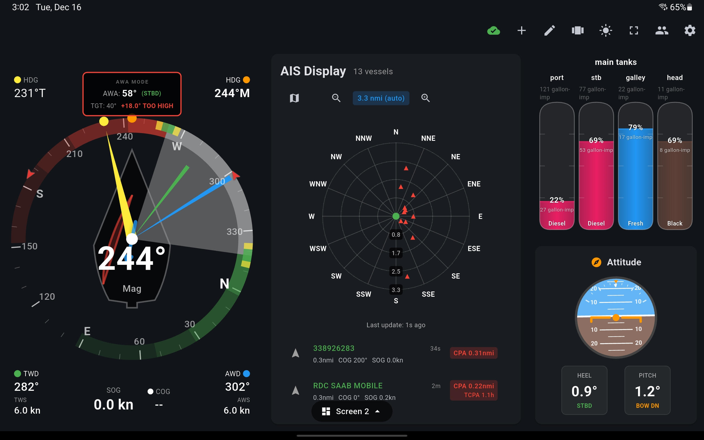

 
## SignalK Dependencies

### Required
- **signalk-units-preference**: Must be installed to have base values converted. Without it many tools will not work.
- **Admin access** - All devices need permission to access to data. ADMIN permission is required for several tools, including the Anchor Alarm and Server Manager.

### Optional
- **signalk-derived-data**: Provides computed values like true wind, VMG, and other derived navigational data
- **signalk-parquet**: Allows some tools to display historic data for selected paths
- **signalk-rpi-monitor**: Required for RPi Monitor tool (CPU, GPU temperature, memory, storage monitoring)
- **signalk-rpi-uptime**: Required for system uptime display in RPi Monitor tool
- **signalk-weatherflow-api**: Required for WeatherFlow Forecast tool (weather data from Tempest stations)
- **signalk-meteoblue-weather**: Weather forecasts from Meteoblue (for Weather API Spinner)
- **signalk-open-meteo-weather**: Weather forecasts from Open-Meteo (for Weather API Spinner) 


## Features

### Real-Time Marine Data Display
- Connect to any SignalK server (local or remote)
- Real-time data streaming via WebSocket
- Support for secure (HTTPS/WSS) and standard connections
- Automatic reconnection on network changes

### Customizable Dashboard
- Multiple dashboard screens with custom layouts
- Drag-and-drop tool placement
- Grid-based responsive layout

### Tool Library

**Display Tools**
- **Radial Gauge**: Circular gauge with arc display for numeric values
- **Linear Gauge**: Horizontal or vertical bar gauge for numeric values
- **Compass Gauge**: Circular compass display for heading/bearing values (supports up to 4 needles)
  - Compare multiple headings on one display (heading, COG, autopilot target, etc.)
  - Multiple styles: classic, arc, minimal, marine
  - Custom labels that stay horizontal for easy reading
- **Text Display**: Large numeric value display with label and unit
  - Smart lat/long formatting (auto-detects and formats as degrees/minutes/seconds)
  - Object value support (displays Map properties as key-value pairs)

- **WeatherFlow Forecast**: Weather forecast from WeatherFlow Tempest station
  - Current conditions (temperature, humidity, pressure, wind)
  - Hourly forecast with weather icons, temperature, precipitation probability
  - Wind direction arrows and speed for each forecast hour
  - Tomorrow's sunrise, sunset, moonrise, and moonset times
  - Configurable hours to display (up to 72 hours)
  - Requires signalk-weatherflow-api plugin

  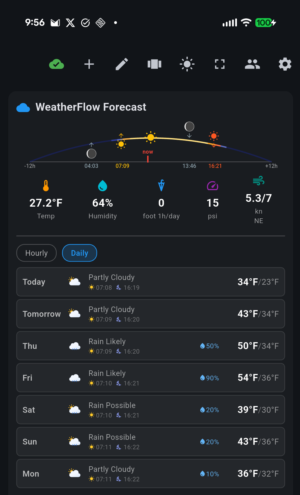
- **Weather API Spinner**: Generic weather forecast using SignalK Weather API
  - Works with any provider implementing the SignalK Weather API
  - Supports Meteoblue, Open-Meteo, WeatherFlow/Tempest, and other providers
  - Spinner-style hourly forecast display
  - Provider name displayed in header
  - Automatic unit conversions

  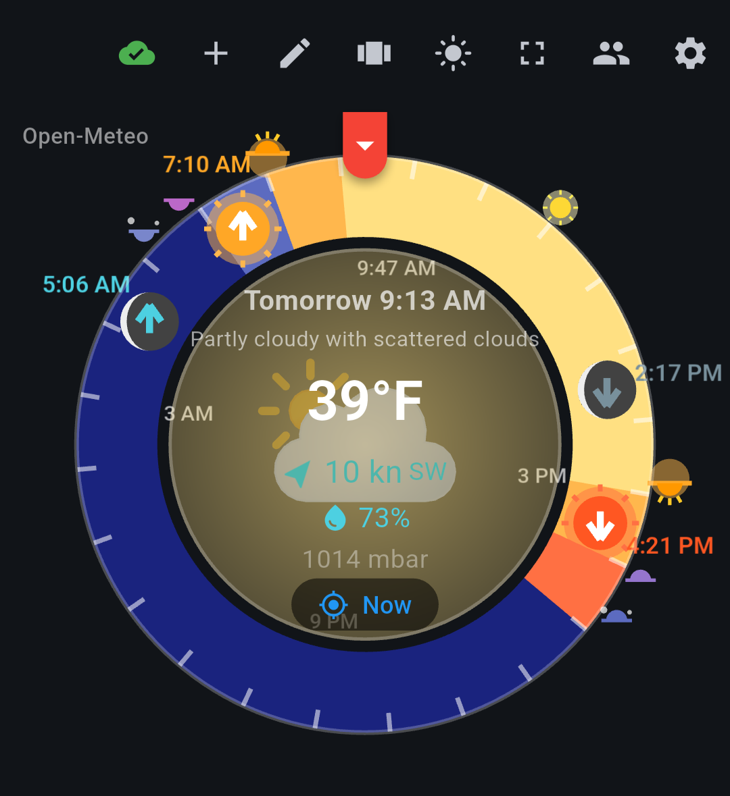

**Chart Tools**
- **Historical Chart**: Line chart showing historical data for up to 3 paths 
- **Real-Time Chart**: Live spline chart showing real-time data for up to 3 paths

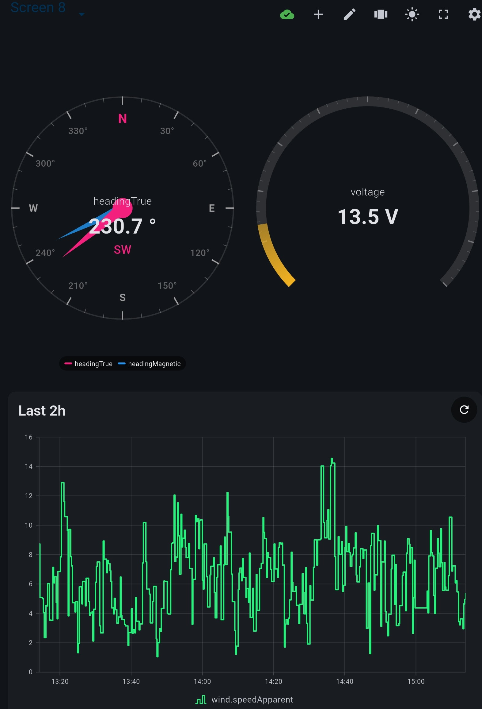
 

- **Radial Bar Chart**: Circular chart displaying up to 4 values as concentric rings

  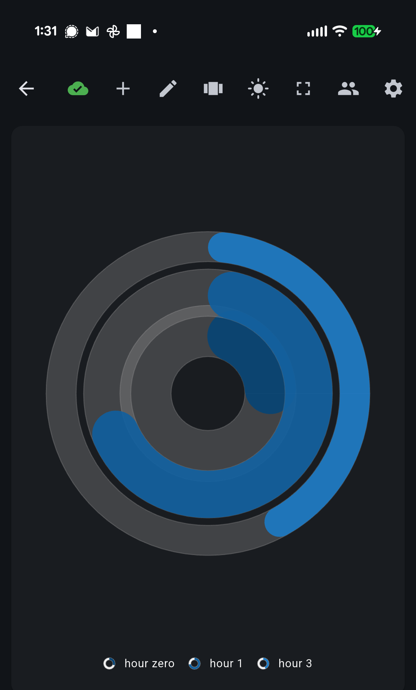

- **Polar Radar Chart**: Polar chart showing magnitude vs angle with area fill (e.g., wind speed/direction)
- **AIS Polar Chart**: Display nearby AIS vessels on polar chart relative to own position

  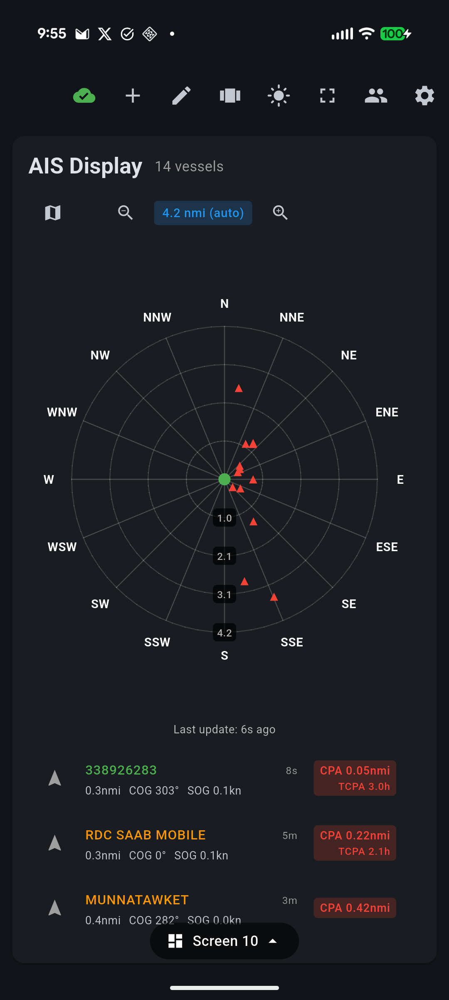

**Navigation Tools**
- **Wind Compass**: Advanced compass with multiple sailing modes
  - **Target AWA Mode**: Performance steering with configurable target angles and tolerance zones
  - **Laylines Mode**: True navigation laylines for upwind waypoint navigation with "can fetch" indicators
  - **VMG Mode**: Real-time Velocity Made Good with polar-based optimization
  - Gradiated sailing zones (red/green) showing optimal sailing angles
  - Dynamic target AWA adjustment based on wind speed and polar data
  - Tap display to cycle between modes
  - Shows heading (true/magnetic), wind direction (true/apparent), SOG, and COG

  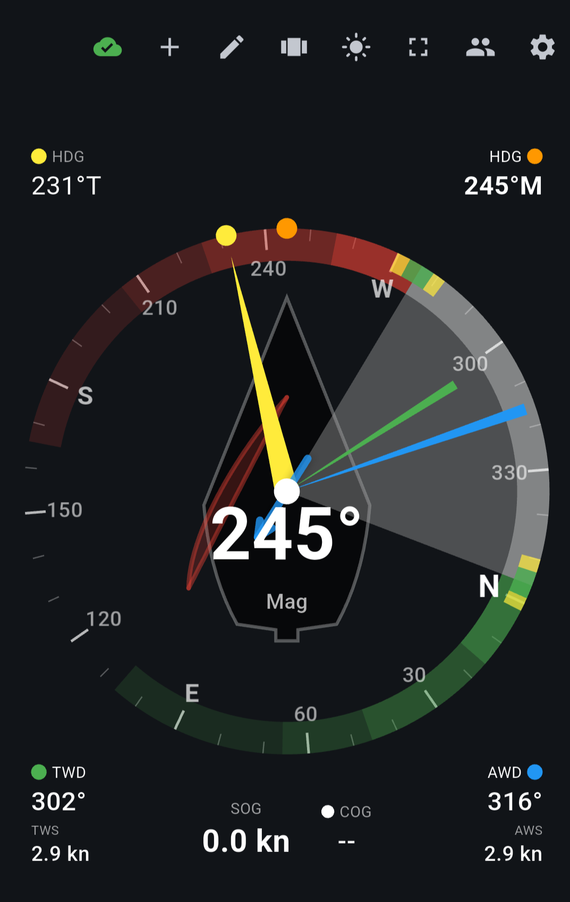

- **Autopilot**: Full autopilot control with compass display, mode selection, and tacking
- **Autopilot V2**: Redesigned circular autopilot with nested controls
  - Banana-shaped heading adjustment buttons (+1, -1, +10, -10) arced around inner circle
  - Mode selector (Compass, Wind, Route) with engage/standby toggle
  - Tack/Gybe banana buttons in Wind mode positioned by turn direction
  - Advance Waypoint and Dodge buttons in Route mode
  - Draggable target heading arrow with long-press activation
  - Incremental command queue with acknowledgment tracking
  - Rudder indicator when space permits
  - Responsive portrait/landscape layouts

  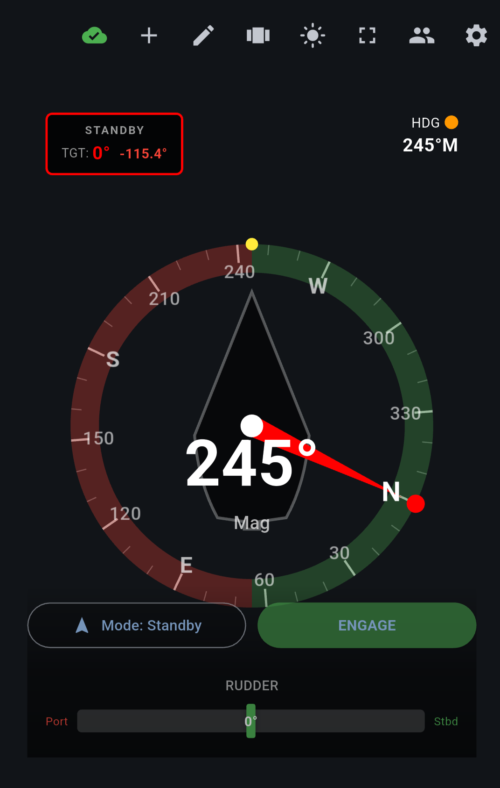
  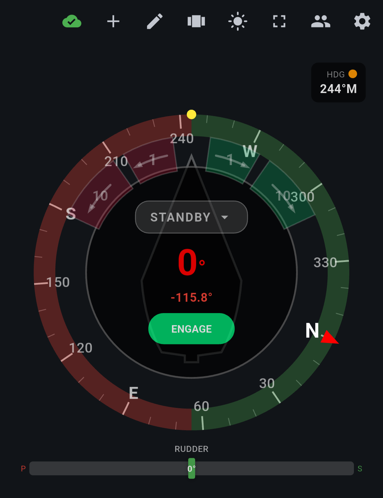


- **Attitude Indicator**: Aircraft-style artificial horizon display
  - Shows vessel pitch and roll in real-time
  - Configurable color scheme
  - Visual horizon line with degree markings

  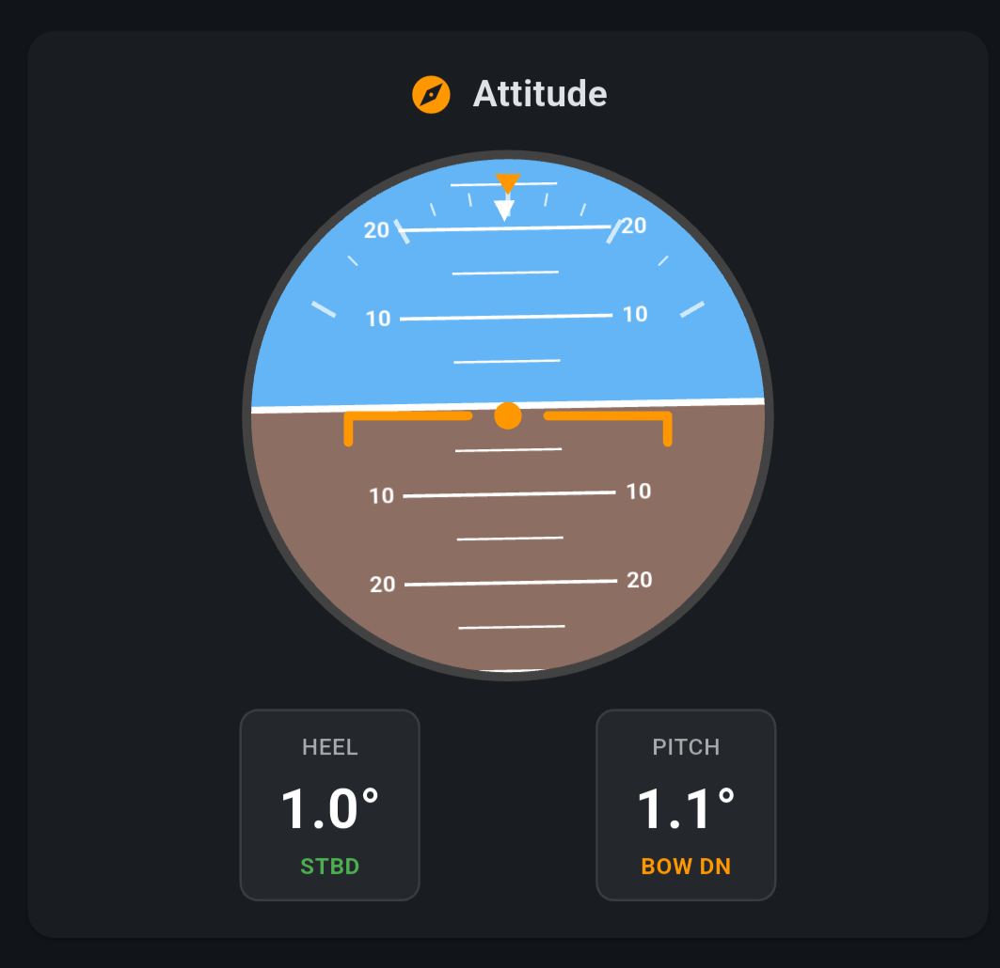

- **GNSS Status**: GPS/GNSS satellite and fix quality display
  - Fix type indicator (No Fix, 2D, 3D, GNSS, DGNSS, RTK Float, RTK Fixed)
  - Satellite count and signal quality
  - Horizontal/vertical dilution of precision (HDOP/VDOP)
  - Data age indicator (LIVE/stale status)
  - Detailed satellite information (PRN, elevation, azimuth, SNR)

  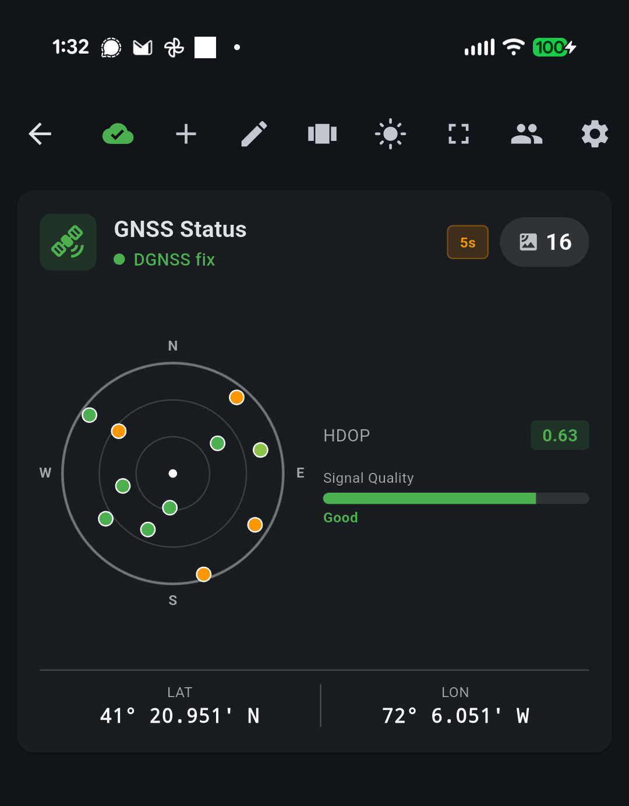

- **Anchor Alarm**: Comprehensive anchor watch with visual monitoring
  - Real-time map display showing anchor position, current position, and swing radius
  - Drop anchor with one tap (rode length auto-set to GPS-from-bow distance + 10%)
  - Configurable alarm radius with visual circle overlay
  - Rode length adjustment via slider (5-100m)
  - Distance from anchor displayed in real-time
  - Alarm triggers when vessel exceeds set radius from anchor point
  - Raise anchor to clear and reset
  - Works with SignalK anchor alarm plugin
- **Position Display**: Current vessel position in configurable formats
  - Latitude/longitude display with multiple format options
  - Degrees, minutes, seconds or decimal degrees
  - Large, readable display for cockpit use

**Electrical Tools**
- **Power Flow**: Visual power flow diagram with animated energy flows
  - Real-time visualization of power sources, battery, and loads
  - Animated flow lines with moving balls showing power direction and magnitude
  - Flow speed indicates current/power level (logarithmic scale for visible differences)
  - **Fully customizable sources**: Add/remove/rename power sources (Shore, Solar, Alternator, Generator, Wind, etc.)
  - **Fully customizable loads**: Add/remove/rename loads (AC Loads, DC Loads, specific circuits)
  - Icon picker with 14+ icons for each source/load
  - Drag-and-drop reordering of sources and loads
  - Battery section showing SOC, voltage, current, power, time remaining, temperature
  - Inverter/charger state display
  - Configurable base color theme
  - Each source/load has configurable SignalK paths for current, voltage, power, frequency, and state

  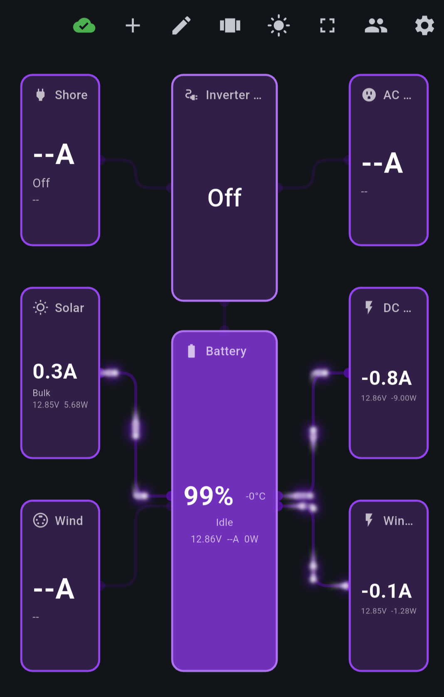

**Control Tools**
- **Switch**: Toggle switch for boolean SignalK paths with PUT support
- **Slider**: Slider control for sending numeric values to SignalK paths with PUT support
- **Knob**: Rotary knob control for sending numeric values to SignalK paths with PUT support
- **Checkbox**: Checkbox for boolean SignalK paths with PUT support with PUT support
- **Dropdown**: Dropdown selector for sending numeric values to SignalK paths with PUT support
- **Tanks**: Display up to 5 tank levels with visual fill indicators
  - Color-coded by tank type (diesel, freshWater, blackWater, wasteWater, liveWell, lubrication, ballast, gas) with icons
  - Optional capacity display

  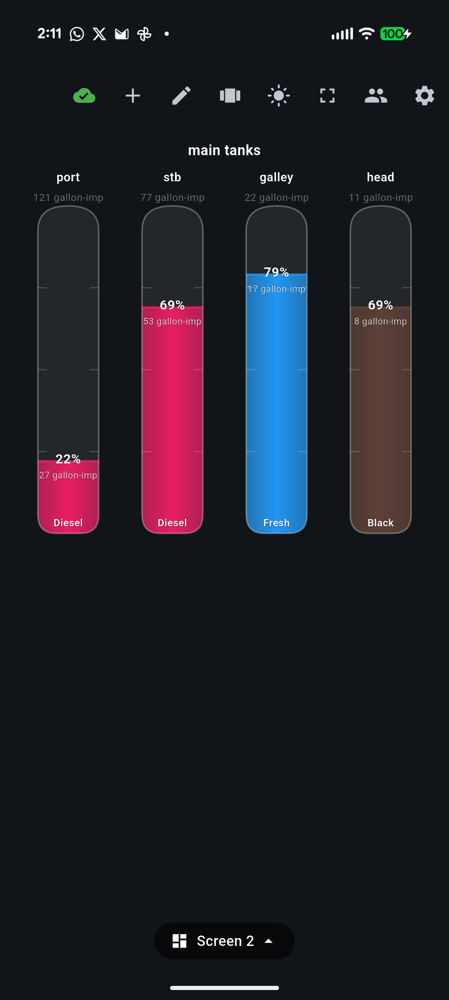

**Utility Tools**
- **Clock/Alarm**: Smart clock with customizable faces and alarms
  - 5 clock face styles: analog, digital, minimal, nautical, modern
  - Multiple alarms with 5 sound options (ding, fog horn, ship bell, whistle, chimes)
  - Alarms persist via SignalK resources API (sync across all devices)
  - Multi-device dismiss: "Dismiss Here" (local) or "Dismiss All" (synced)
  - 12h/24h time format toggle with AM/PM selector
  - Snooze support (1, 5, 9, 15, 30 minutes)
  - Long-press clock face to manage alarms

  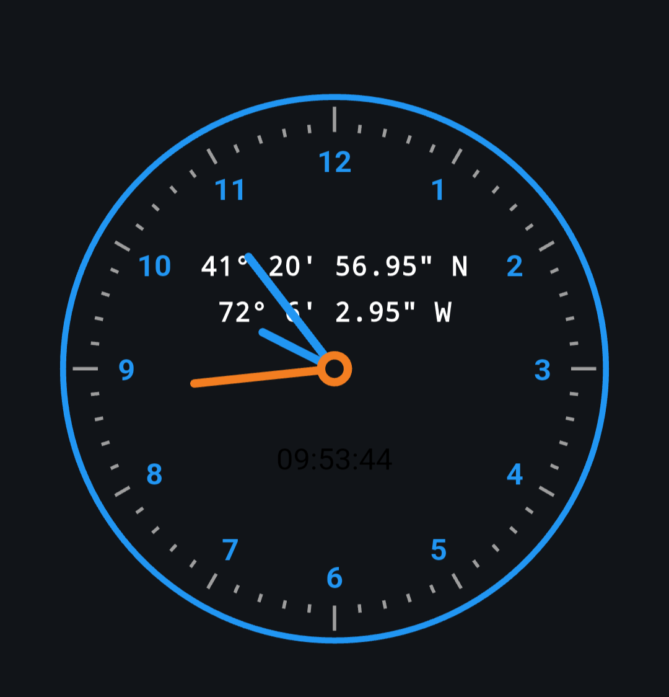
  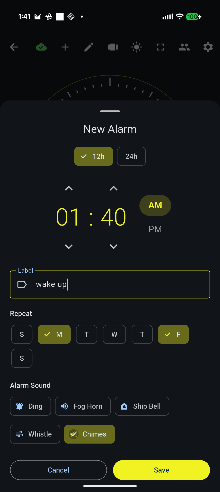
  

**System Tools**
- **Server Status**: Real-time SignalK server monitoring and management
  - Live server statistics (uptime, delta rate, connected clients, available paths)
  - Per-provider statistics with delta rates
  - Plugin management (view all plugins, enable/disable with tap)
  - Webapp listing with versions
  - Server restart functionality
  - Auto-updates every 5 seconds

  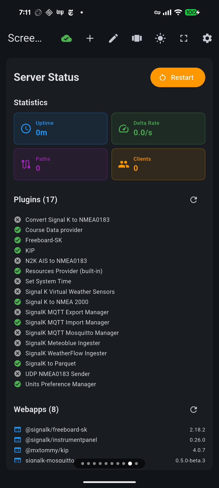

- **RPi Monitor**: Raspberry Pi system health monitoring
  - CPU utilization (overall and per-core)
  - CPU and GPU temperature with color-coded warnings
  - Memory and storage utilization
  - System uptime display
  - Requires signalk-rpi-monitor and signalk-rpi-uptime plugins

  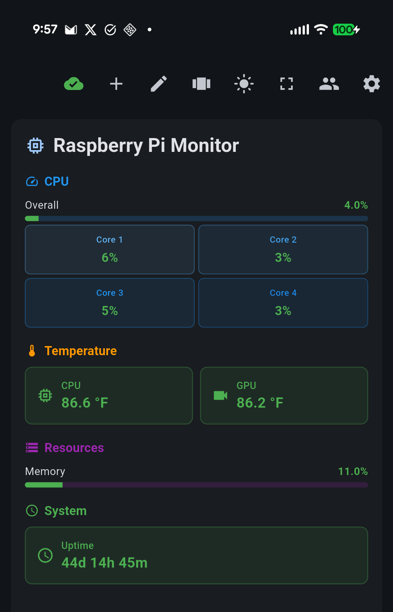

**Crew Communication Tools**
- **Crew Messages**: View recent crew messages in a compact widget

  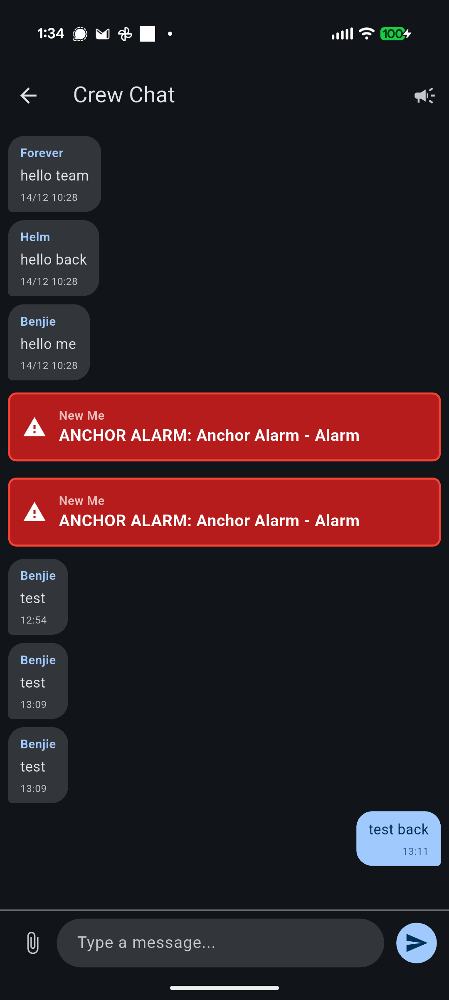

- **Crew List**: See online/offline crew members at a glance

  

- **Intercom**: Quick-access PTT button for voice communication

  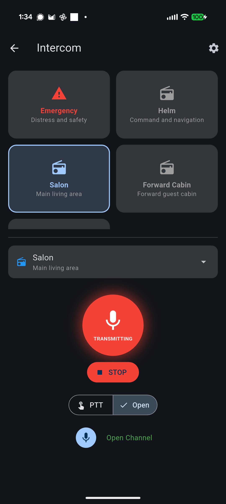

- **File Share**: View recently shared files

### 👥 Crew Communication System

ZedDisplay includes a complete peer-to-peer communication system for vessel crew. All communication flows through your SignalK server—no cloud services, external servers, or internet connection required. Every crew member simply needs ZedDisplay connected to the same SignalK server on your boat's network.

**How It Works**

SignalK acts as the message broker and data store:
- Crew profiles, messages, and file metadata are stored in SignalK's Resources API using custom resource types (`zeddisplay-messages`, `zeddisplay-crew`, `zeddisplay-files`, `zeddisplay-channels`, `zeddisplay-alarms`)
- Custom resource types are automatically created on first connection (requires admin authentication)
- Data is isolated from other SignalK apps—only ZedDisplay reads these resource types
- All devices subscribe to crew data paths and receive real-time updates via WebSocket
- Messages persist on the SignalK server and sync to devices when they connect
- Voice uses WebRTC for audio with SignalK handling connection signaling

**Crew Identity & Presence**
- Create crew profiles with name and role (Captain, First Mate, Crew, Guest)
- Real-time online/offline status via heartbeat system (30-second intervals)
- Status indicators (On Watch, Off Watch, Standby, Resting, Away)
- Automatic presence detection—see who's online across all connected devices

**Text Messaging**
- **Broadcast**: Send messages to all crew at once
- **Direct**: Private one-on-one conversations
- **Status broadcasts**: Quick status updates (watch changes, anchored, underway)
- **Emergency alerts**: MOB and All Hands alerts with distinct notifications
- Messages stored on SignalK with 30-day retention
- Offline caching—read messages without connection, sync when back online
- Unread badges show new message counts

**File Sharing**
- Share files directly between crew devices over local network
- Supported formats: images (PNG, JPG, GIF), documents (PDF), navigation files (GPX, KML), audio, and ZedDisplay dashboards (.zedjson)
- **Small files** (< 100KB): Embedded directly in SignalK for instant delivery
- **Large files**: Sender's device runs a temporary HTTP server; receivers download directly from sender
- No cloud upload—files transfer peer-to-peer on your boat's WiFi
- Preview images and documents before downloading
- Export to other apps via system share sheet

**Voice Intercom**
- VHF radio-style channel system for shipboard communication
- Default channels: Emergency, Helm, Salon, Forward Cabin, Aft Cabin (customizable)
- **PTT Mode** (Push-to-Talk): Hold button to transmit, release to listen—like a handheld radio
- **Duplex Mode**: Open two-way audio—like a phone call, both parties hear each other continuously
- **Direct Calls**: Private one-on-one voice calls to specific crew members
- WebRTC handles audio encoding/transmission; SignalK handles call setup signaling
- Optimized for local network—works without internet, low latency on boat WiFi
- Get notified when someone transmits on a channel (tap notification to join)
- Mute controls for incoming audio

### Tool Management
- Create and save custom tool configurations
- Import/export tool definitions
- Tool library with search and filtering
- Reusable tools across multiple screens

### Setup Management & Sharing
- Save multiple dashboard setups
- Switch between setups instantly
- Export setups as JSON files
- Import shared setups from other users
- Perfect for different boat configurations or conditions

### Secure Authentication
- SignalK OAuth2 authentication flow
- Device registration and approval
- Secure token storage
- Multiple server support

### Modern UI/UX
- Material Design 3
- Dark and light themes
- Smooth animations and transitions
- Responsive layout for phones and tablets with separate layouts for portrait and landscape modes

## Screenshots

### Dashboard Overview


*Dashboard with navigation instruments and tools*

### Setup & Configuration

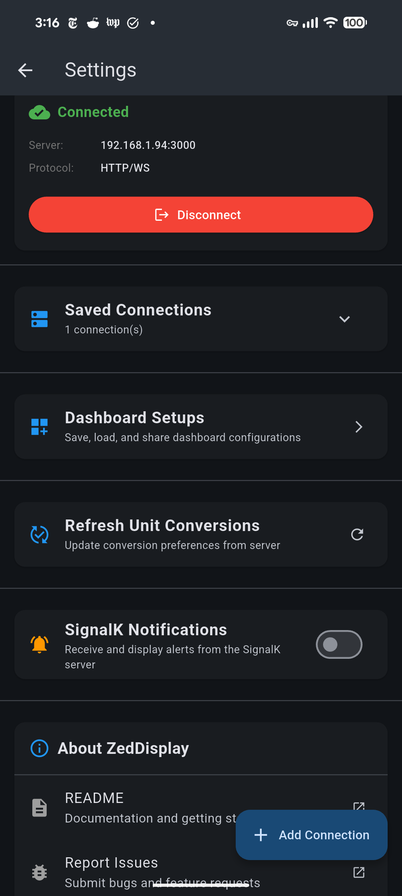

*Setup management and sharing*

### Crew Communication


*Crew status, messaging, and voice intercom*


## Getting Started

### Prerequisites

- Flutter SDK (>=3.8.0 <4.0.0)
- Android SDK (for Android builds) or Xcode (for iOS builds)
- Access to a SignalK server (local or remote)

### Installation

1. **Clone the repository**
   ```bash
   git clone https://github.com/motamman/ZedDisplay.git
   cd ZedDisplay
   ```

2. **Install dependencies**
   ```bash
   flutter pub get
   ```

3. **Generate code**
   ```bash
   dart run build_runner build --delete-conflicting-outputs
   ```

4. **Run the app**
   ```bash
   flutter run
   ```

### First Time Setup

1. Launch the app
2. Add your SignalK server connection:
   - Enter server URL (e.g., `192.168.1.100:3000` or `demo.signalk.org`)
   - Choose secure connection if using HTTPS/WSS
   - Give it a friendly name
3. Approve the device in your SignalK server's Admin UI
4. Start customizing your dashboard!

## Usage

### Creating Your First Dashboard

1. **Connect to your SignalK server**
   - Tap "Add Connection" on the connection screen
   - Enter your server details and connect

2. **Add Dashboard Screens**
   - Open the Dashboard Manager (☰ menu)
   - Tap "+" to add a new screen
   - Give it a name (e.g., "Navigation", "Engine")

3. **Add Tools to Your Screen**
   - Tap the "+" button to add tools
   - Choose a tool type (gauge, chart, compass, etc.)
   - Configure the data source and styling
   - Tool automatically places on the screen (can be moved/resized in edit mode)

4. **Save Your Setup**
   - Go to Settings → Dashboard Setups
   - Tap "Save Current"
   - Give your setup a name

### Sharing Setups

1. **Export a Setup**
   - Settings → Dashboard Setups → Manage Setups
   - Select your setup and tap "Share"
   - Share the JSON file via your preferred method

2. **Import a Setup**
   - Settings → Dashboard Setups → Manage Setups
   - Tap the import icon (📤)
   - Choose "Browse File" or "Paste JSON"
   - Decide whether to switch to it immediately

### Switching Between Setups

Perfect for different scenarios:
- **Sailing Mode**: Wind instruments, compass, speed
- **Motorsailing Mode**: Engine gauges, fuel, temperature
- **Anchoring Mode**: Depth, position, battery status

Simply go to Settings → Dashboard Setups and tap the setup you want to activate!

### Using Crew Communication

**Prerequisites**: All crew members need ZedDisplay installed and connected to the same SignalK server. The SignalK server (typically running on a Raspberry Pi or similar) acts as the hub for all communication.

1. **Set Up Your Profile**
   - Tap the Crew icon (👥) in the app bar
   - Create your profile with name and role (Captain, First Mate, Crew, Guest)
   - Set your status (On Watch, Off Watch, Standby, etc.)
   - Your profile syncs to SignalK—other crew will see you as "online"

2. **Send Messages**
   - Tap the Chat tab in the Crew screen
   - **Broadcast**: Type a message and tap send—goes to all crew
   - **Direct message**: Tap a crew member's name, then compose your message
   - **Quick status**: Use the status picker for common updates (watch changes, anchored, etc.)
   - Messages persist on SignalK and sync to all devices

3. **Share Files**
   - Tap the Files tab in the Crew screen
   - Tap + to select a file from your device
   - Small files send instantly; large files start a local server
   - Other crew see the file appear and can download it
   - For dashboards (.zedjson), recipients can import with one tap

4. **Voice Intercom (Channel Mode)**
   - Tap the Intercom tab in the Crew screen
   - Select a channel (Emergency, Helm, Salon, Forward Cabin, or Aft Cabin)
   - **PTT Mode** (default): Hold the microphone button to talk, release to listen
     - Works like a handheld VHF radio—only one person transmits at a time
   - **Duplex Mode**: Toggle the duplex switch for open two-way audio
     - Both parties can talk and hear simultaneously—like a phone call
   - Channel notifications alert you when someone transmits (tap to join)

5. **Direct Voice Calls**
   - In the Crew list, tap the phone icon next to a crew member
   - They receive an incoming call notification
   - When they accept, you have a private two-way voice call
   - Either party can hang up to end the call

## Project Structure

```
lib/
├── config/           # App configuration
├── models/           # Data models
│   ├── dashboard_layout.dart
│   ├── dashboard_setup.dart
│   ├── tool.dart
│   ├── server_connection.dart
│   ├── crew_member.dart        # Crew profiles and presence
│   ├── crew_message.dart       # Text messaging
│   ├── shared_file.dart        # File sharing
│   └── intercom_channel.dart   # Voice intercom
├── screens/          # App screens
│   ├── splash_screen.dart
│   ├── server_list_screen.dart
│   ├── connection_screen.dart
│   ├── dashboard_manager_screen.dart
│   ├── settings_screen.dart
│   ├── setup_management_screen.dart
│   └── crew/                   # Crew communication screens
│       ├── crew_screen.dart
│       ├── crew_profile_screen.dart
│       ├── chat_screen.dart
│       ├── direct_chat_screen.dart
│       └── intercom_screen.dart
├── services/         # Business logic
│   ├── signalk_service.dart
│   ├── storage_service.dart
│   ├── dashboard_service.dart
│   ├── tool_service.dart
│   ├── setup_service.dart
│   ├── auth_service.dart
│   ├── crew_service.dart       # Crew identity & presence
│   ├── messaging_service.dart  # Text messaging
│   ├── file_share_service.dart # File sharing
│   ├── file_server_service.dart # HTTP server for files
│   └── intercom_service.dart   # WebRTC voice intercom
├── widgets/          # UI components
│   ├── compass_gauge.dart
│   ├── radial_gauge.dart
│   ├── linear_gauge.dart
│   ├── tools/                  # Tool implementations
│   └── crew/                   # Crew communication widgets
│       ├── crew_list.dart
│       ├── file_list.dart
│       ├── file_viewer.dart
│       ├── intercom_panel.dart
│       └── incoming_call_overlay.dart
└── main.dart
```

## Architecture

### Data Flow
```
SignalK Server (WebSocket)
    ↓
SignalKService (WebSocket handler)
    ├── DataCacheManager (TTL-based caching & pruning)
    ├── ConversionManager (Unit conversions)
    ├── NotificationManager (Alert processing)
    └── AISManager (Vessel tracking)
    ↓
DashboardService (Data distribution)
    ↓
Tool Components (Display layer)
    └── Tool Configurators (Strategy pattern)
```

### Storage
- Local persistent storage for connections, dashboards, tools, setups, and auth tokens
- JSON serialization for import/export

### State Management
- **Provider**: State management and dependency injection
- **ChangeNotifier**: Reactive updates across the app

## Technologies Used

- **Flutter**: Cross-platform UI framework
- **Syncfusion**: Gauges and charts library
- **Provider**: State management
- **SignalK**: Marine data protocol
- **WebSocket**: Real-time data streaming
- **WebRTC**: Peer-to-peer voice communication (flutter_webrtc)
- **Shelf**: HTTP server for file sharing
- **Hive**: Local data persistence

## Development

### Running Tests
```bash
flutter test
```

### Building for Release

**Android:**
```bash
flutter build apk --release
```

**iOS:**
```bash
flutter build ios --release
```

### Code Generation
When adding new models with JSON serialization:
```bash
dart run build_runner build --delete-conflicting-outputs
```

## Configuration

The app includes a configuration system for sensitive data (see `CONFIG_SETUP.md`), though it's currently not required. This infrastructure is ready for future use with API keys or other configuration values.

## Developer Documentation

### Creating Custom Tools
See the comprehensive guide: [`docs/public/creating-new-tools-guide.md`](docs/public/creating-new-tools-guide.md)

This 900+ line guide covers:
- Tool architecture and the Strategy pattern
- Step-by-step tool creation (with examples)
- Tool configurators and the configuration system
- Best practices and testing
- Troubleshooting common issues

Perfect for developers wanting to add new tool types to ZedDisplay!

## Contributing

Contributions are welcome! Please feel free to submit a Pull Request.

1. Fork the repository
2. Create your feature branch (`git checkout -b feature/AmazingFeature`)
3. Commit your changes (`git commit -m 'Add some AmazingFeature'`)
4. Push to the branch (`git push origin feature/AmazingFeature`)
5. Open a Pull Request

## License

This project is licensed under the MIT License - see the LICENSE file for details.

## Support

For questions or issues:
- Open an issue on GitHub
- Check the [SignalK documentation](https://signalk.org/documentation/)

## Roadmap

### General Features
- [ ] Offline mode with cached data
- [ ] Chart playback for historical data
- [ ] Enhanced alerts and notification rules
- [ ] Weather integration (GRIB files, forecasts)
- [x] AIS target display (completed in v0.2.0+3)
- [ ] Route planning and waypoint navigation
- [ ] More chart types (bar charts, area charts)
- [ ] AI integration
- [ ] AIS collision avoidance using `vessels.<uuid>.navigation.closestApproach` (CPA/TCPA)
- [ ] AIS collision alerts using `notifications.danger.collision` (requires collision-detector plugin)
- [x] Weather forecast tool (completed - WeatherFlow Tempest integration)
- [x] Generic Weather forecast tool using Weather API (completed - Weather API Spinner) 
- [x] Raspberry Pi health monitoring tool (completed - CPU, memory, temperature, uptime monitoring)
- [ ] Manage overflows with dynamic sizing (improve responsive layout across all screen sizes)

### Wind Compass Improvements
- [x] Target AWA mode with performance zones (completed)
- [x] True laylines for waypoint navigation (completed)
- [x] VMG optimization with basic polar data (completed)
- [x] Custom polar data upload
- [ ] Downwind polar angles
- [ ] VMG optimization for reaching/running
- [ ] Polar curve visualization

### Crew Communication (completed)
- [x] Crew identity and presence system
- [x] Text messaging (broadcast and direct)
- [x] Status broadcasts and alerts
- [x] File sharing via local HTTP server
- [x] Voice intercom with WebRTC (E2E encrypted via SRTP - direct P2P, no relay)
- [x] VHF-style channel system
- [x] Direct one-on-one voice calls
- [x] Incoming call notifications
- [x] Dashboard widgets for crew features
- [x] Crew deletion (captain can remove anyone, self can remove self)
- [ ] End-to-end encryption for text messages (X25519 key exchange)
- [ ] Push notifications when app is backgrounded
- [ ] Message search
- [ ] Read receipts
- [ ] Typing indicators
- [ ] Attach files to text messages

---


